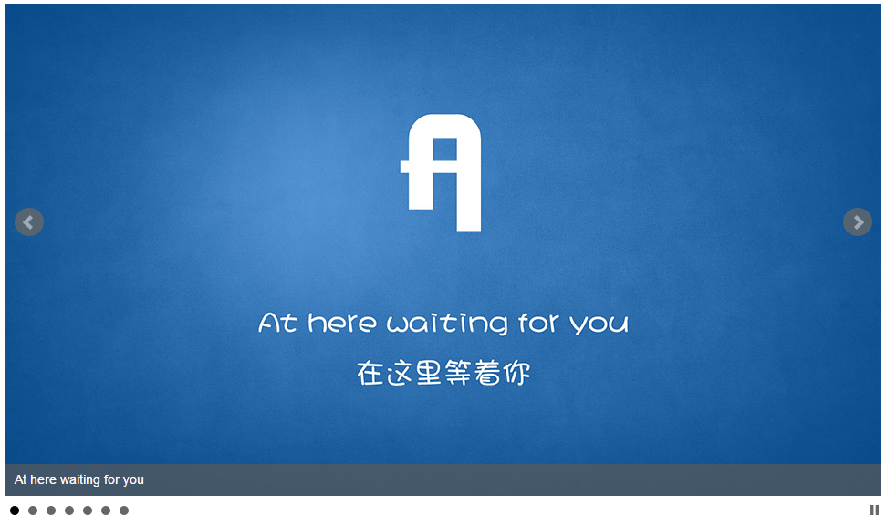

# liwy-slide
* 相关技术: grunt, karma, jquery等
* 示例: [https://liwyspace.github.io/liwy-slide/](https://liwyspace.github.io/liwy-slide/)
* 作者: liwy

> 官网: [开源小屋 www.oscafe.net](http://www.oscafe.net)  
> 邮箱: oscafe_net@163.com  
> QQ: 332301842  
>  
> 扫描关注微信公众号：开源小屋  
>   

# 示例
[https://liwyspace.github.io/liwy-slide/](https://liwyspace.github.io/liwy-slide/)

# 主要功能
 * @todo 单项或多项显示
  *设置项的数量
  *设置项的右边距
 * @todo 项的无限循环功能
 * @todo 传送带模式
  * 自定义项宽度
  * 设置移动速度
 * @todo 鼠标拖动与触摸拖动
 * @todo 单项时out/in动画
  * 设置动画时间
 * @todo 自动高度
 * @todo 自动播放
  * 设置播放间隔
  * 设置鼠标悬停
 * @todo next/prev按钮
  * 自定义按钮
 * @todo play/stop按钮
 * @todo dots按钮
  * 自定义按钮
 * @todo 自适应
  * 调整项数量
  * 调整next/prev按钮显示
  * 调整dots按钮显示
 * @todo 切换方向
  * 从左到右
  * 从右到左
  * 从上到下
  * 从下到上
  * 褪色模式
 * @todo caption标题
 * @todo 缩略图按钮
 * @todo 延迟加载
 * @todo 事件回调函数
 * @todo reload slide
 * @todo 使用css3 transition

# 支持

# License
MIT
